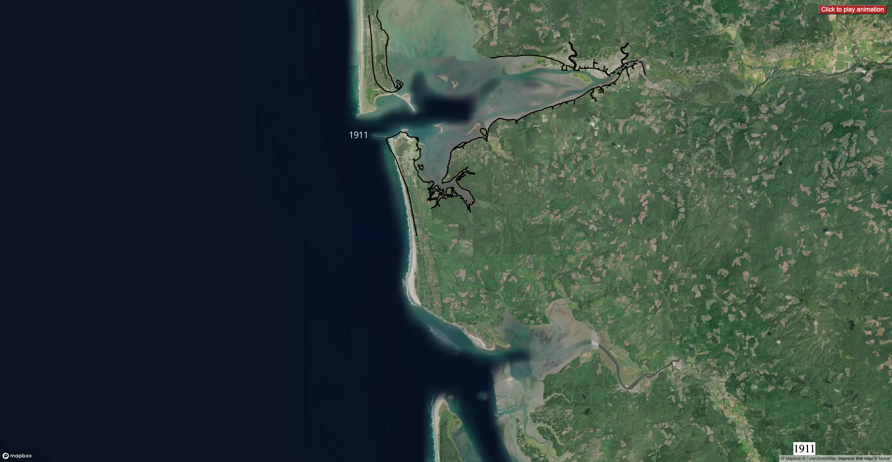

# Grays_Harbor_Storymap

This project maps animated historical shoreline changes dating as far back as Holocene in Grays Harbor County, Washington. Currently only the section between the City of Westport and Tokeland is mapped. We also mapped the projected shoreline changes under different sea level rise scenarios. At this point, other factors that can contribute to shoreline changes like the co-seismic subsidence and tidal waves are not considered. **Can we consider these factors as well?** We mapped the shoreline changes using the historical shoreline data from the Washington State Department of Natural Resources (DNR) and the US Geological Survey (USGS). The historical shoreline data is available at the [Washington State Shoreline Change Viewer](https://www.dnr.wa.gov/shorelines/shoreline-change-viewer). The historical shoreline data is available at the [Washington State Shoreline Change Viewer](https://www.dnr.wa.gov/shorelines/shoreline-change-viewer). The historical shoreline data is available at the [Washington State Shoreline Change Viewer](https://www.dnr.wa.gov/shorelines/shoreline-change-viewer). The historical shoreline data is available at the [Washington State Shoreline Change Viewer](https://www.dnr.wa.gov/shorelines/shoreline-change-viewer). The historical shoreline data is available at the [Washington State Shoreline Change Viewer](https://www.dnr.wa.gov/shorelines/shoreline-change-viewer). The historical shoreline data is available at the [Washington State Shoreline Change Viewer](https://www.dnr.wa.gov/shorelines/shoreline-change-viewer). The historical shoreline data is available at the [Washington State Shoreline Change Viewer](https://www.dnr.wa.gov/shorelines/shoreline-change-viewer). The historical shoreline data is available at the [Washington State Shoreline Change Viewer](https://www.dnr.wa.gov/shorelines/shoreline-change-viewer). The historical shoreline data is available at the [Washington State Shoreline Change Viewer](https://www.dnr.wa.gov/shorelines/shoreline-change-viewer). The historical shoreline data is available at the [Washington State Shoreline Change Viewer](https://www.dnr.wa.gov/shorelines/shoreline-change-viewer). The historical shoreline data is available at the [Washington State Shoreline Change Viewer](https://www.dnr.wa.gov/shorelines/shoreline-change-viewer). The historical shoreline data is available at the [Washington State Shoreline Change Viewer](https://www.dnr.wa.gov/shorelines/shoreline-change-viewer). The historical shoreline data is available at the [Washington State Shoreline Change Viewer](https://www.dnr.wa.gov/shorelines/shoreline-change-viewer). The historical shoreline data is available at the [Washington State Shoreline Change Viewer](https://www.dnr.wa.gov/shorelines/shoreline
***
## Objective

Climate change and seismic hazards are about to fundamentally reshape coastal communities in Pacific Northwest, actions are required to mitigate hazard risks. However, climate change and seismic activities are fraught with uncertainty. That is to say, we cannot straightforwardly assign a probablity to each sceanrio of sea level rise and seismic impact. Research has found that uncertainty could have a detrimental effect on decision making, stakeholders may either suppress or overreact to uncertaities.

The objective of this project is to use geonarrative tools to communicate changes of communities' living space and uncertainties therein. Specifically, we visualize the shoreline changes as a cotinuous process emerging from history into the future. We hope animation which bridges past, present, and future can help communicate risk and uncertainties to stakeholders in a way that facilitates informed decision making. 

However, the records of historical shorelines are not complete. The shorelines in our mapped area are only surveyed in the year of 1860, 1911, 1926, 1941, 1954, 2006, and 2016 in Westport, and year of 1911, 1922, 1953, 2007 in the south beach. And the shorelines evloved rapidly between intervals, for instance, from 1860 to 1911. To make the animation as smooth as we can, we use interpolation to estimate the location of shoreline when it was not surveyed. The methods of interpolation is given in the [Manipulation of Shorelines](#manipulation-of-shorelines)
***

## Demo

This section will demostrate the interface of the three parts of this storymap: (1) animation of the shoreline changes; (2) map of the sea level rise scenarios; (3) 
### Animation of the shoreline changes

The animation is available at [Animation of the shoreline changes](https://jerryliu-96.github.io/Grays_Harbor_Storymap/animation_historical_shoreline.html)

Click the red button at the top right corner to play the animation. The year is shown at the mouth of the Grays Harbor on the map. To pause the animation, click the red button again. Below is the picture to show the interface of the animation.

>  - As you can see the shoreline changed rapidly, especially between 1860 and 1911. Interpolate the location of the shoreline during years when it is not surveyed may help us to make the animation smoother.
>  - The shoreline of 1860 at Westport did not stretch to the south, is there any way to extend the line to the south?

### Map of the sea level rise scenarios

The sea level rise scenarios are available at [Map of the sea level rise scenarios](https://jerryliu-96.github.io/Grays_Harbor_Storymap/test_sea_level_rise.html)

> This is a test page, now it displays shorelines (MHHW) after sea level rise from 1 feet to 10 feet at increment of 1 in one layer. I will add a layer control of sea leve rise later.

***

## Data Sources

We gathered data from sources listed below. We converted data from its original file format to GeoJSON format. The data is available in the `assets` folder. 

### Historical Shorelines
Historical shoreline data was downloaded from [NOAA Shoreline Data Explorer](https://geodesy.noaa.gov/NSDE/).

Shoreline of year 1860 is available in the format of shoreline manuscript (t-sheet), all other shorelines has been vectorized by National Oceanic and Atmospheric Administration (NOAA) National Geodetic Survey (NGS).

### Sea level rise scenarios
Sea level rise scenarios were downloaded from [NOAA Sea Level Rise Viewer](https://coast.noaa.gov/slr/).

NOAA simulated sea level rise scenarios from 1 feet to 10 feet in 1 feet increments. We also wrote code to simulate sea level rise scenarios at a finer scale based on Digital Elevation Model (DEM) available at [NOAA Sea Level Rise Viewer](https://coast.noaa.gov/slr/) in GeoTIFF format. The code is available in the `assets/shoreline.py`. 

***
## Methodology of shoreline manipulation

We manipulate the shorelines to interpolate the location of shoreline when it was not surveyed, and shorelines under sea level rise scenarios not available from NOAA. The methods are berifly described in the sections below. All codes are available in this repository.

### Historical Shoreline interpolation
We referred to paper [Historical evolution of the Columbia River littoral cells](https://www.sciencedirect.com/science/article/pii/S002532271000068X?casa_token=TcagawtuglwAAAAA:fanvZ6TIDJHgqDyYTeEVTLXf1QSIoC0YUe5b-EEJ-8XqMxwxYB0sxpHubiRMz6I_KNp5z1y8ycg) by G. Kaminsky, P. Ruggiero, M. Buijsman, and D. McCandless. Shoreline change rate at was given in their paper. We use the change rate to estimate the location of shoreline in year when it is not surveyed.

### Sea level rise not readily available from [NOAA Sea Level Rise Viewer](https://coast.noaa.gov/slr/)

We use marching squares algorithm to generate sea level rise scenarios at a finer scale based on Digital Elevation Model (DEM) available at [NOAA Sea Level Rise Viewer](https://coast.noaa.gov/slr/) in GeoTIFF format. The code is available in the `assets/shoreline.py`. This algorithm can generate shorelines under any given sea level rise scenarios. 

### Uncertainties in historical shoreline data